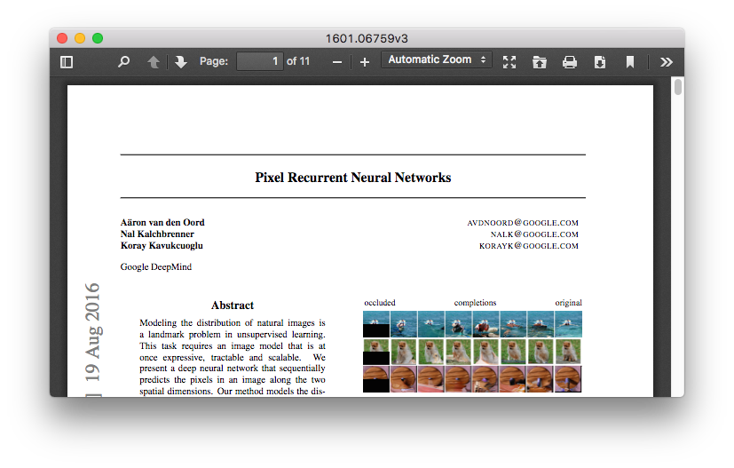

# electron-pdf-window

view PDF files in electron browser windows. this module adds support for viewing
PDF files in electron [`BrowserWindow`s](http://electron.atom.io/docs/api/browser-window/).
it works even if you navigate to a PDF file from a site, or opening a PDF file in
a new window. a `PDFWindow` instance is just a subclass of `BrowserWindow` so it
can be used just like it.

<p align="center">
  
</p>


``` javascript
const { app } = require('electron')
const PDFWindow = require('electron-pdf-window')

app.on('ready', () => {
  const win = new PDFWindow({
    width: 800,
    height: 600
  })

  win.loadURL('http://mozilla.github.io/pdf.js/web/compressed.tracemonkey-pldi-09.pdf')
})
```

## install

```
$ npm i electron-pdf-window
```

## usage

#### `win = new PDFWindow([opts])`
`win` is an electron [`BrowserWindow`](http://electron.atom.io/docs/api/browser-window/)
that has support for viewing PDF files.

#### `PDFWindow.addSupport(win)`
adds PDF viewing support for `win`, which is a `BrowserWindow` instance.

## using from the renderer process

Using the `PDFWindow` class directly from the renderer process is not
recommended, because electron doesn't support proper extending of their built-in
classes. In order to add PDF support from the renderer, use the `addSupport`
method.

``` js
const { BrowserWindow } = require('electron').remote
const PDFWindow = require('electron-pdf-window')

const win = new BrowserWindow({ width: 800, height: 600 })

PDFWindow.addSupport(win)

win.loadURL('file:///a/b/c.pdf')
```

## test

```
$ npm test
```
